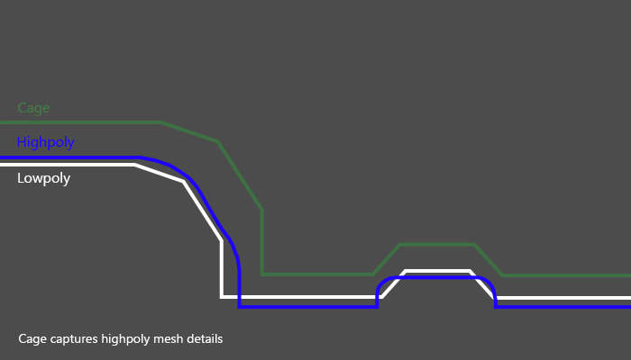

# 개요

AI 기반 3D 생성 모델(TRELLIS)의 결과물을 웹 환경에서 활용하기 위한 최적화 접근법을 분석한 보고서

초기에는 geometry reduction 가 문제해결의 핵심이라고 판단했으나,
실제 실험을 통해 다음과 같은 관찰이 이루어졌다.

> AI 생성 mesh에서는 geometry reconstruction보다
> appearance preservation이 더 높은 시각 품질을 제공할 수 있다.

## 세 가지 접근법

- 케이스 1 — 프로토타입(QEM+rebake)
- 케이스 2 — 리팩토링(PIF 기반)
- 케이스 3 — AIMeshOptimizer (Blender 기반)

---

## 세 접근법의 핵심 차이

| 항목        | 프로토타입               | PIF 리팩토링                                     | AIMeshOptimizer            |
| ----------- | ------------------------ | ------------------------------------------------ | -------------------------- |
| 핵심 철학   | Reconstruction           | Perceptual Reconstruction                        | Preservation               |
| 목표        | geometry, texture 재구성 | perceptual-aware 재구성                          | 기존 표현 최대 보존        |
| UV 처리     | 새 UV 생성               | 새 UV 생성                                       | 기존 UV 유지               |
| 텍스처 처리 | rebake                   | rebake                                           | 기존 texture 유지          |
| 폴리곤 축소 | QEM(PyMeshLab)           | PIF 기반 QEM(PyMeshLab)                          | Blender Decimate           |
| 내부면 처리 | 없음                     | visibility, suppression, contamination 기반 제어 | 없음                       |
| 구조 복잡도 | 중간                     | 높음                                             | 매우 낮음                  |
| 주요 강점   | 자동화된 low poly 생성   | perceptual preservation                          | appearance coherence 유지  |
| 주요 약점   | baking artifact          | tuning complexity                                | geometry intelligence 부족 |

---

# 케이스 1 — 프로토타입(QEM+rebake)

초기 프로토타입은 다음 전제를 기반으로 설계되었다.

> AI 생성 mesh는 messy하므로
> 새로운 low poly asset으로 재구성해야 한다.

## 구조

```
High Poly GLB(Messy AI Mesh)
    ↓
Cleanup
    ↓
QEM Simplification
    ↓
새 UV 생성
    ↓
Texture Rebake
    ↓
Low Poly GLB
```

---

## 결과물

todo: 3d glb viewer 를 구현해서 넣을 예정(data/case1/)

---

## 주요 로직 분석

### 1. geometry canonicalization

이 단계는 입력 GLB를 geometry processing 가능한 canonical OBJ 형태로 정규화한다.

- world space 기준 mesh merge
- triangulation
- degenerate dissolve
- remove doubles
- face normal recalculation
- metadata 생성

**특징: UV가 이 단계에서 소실된다**

→ 이후 파이프라인은 geometry reconstruction 중심으로 진행

→ texture와 UV 는 이후 bake를 통해 다시 복원하는 전략

---

### 2. QEM reduction

PyMeshLab 기반 QEM simplification 단계(vertex 감소)

단순한 중요도 계산 적용: `combined = curvature × (0.3 + 0.7 × visibility)`

- 곡률(curvature)이 높을수록 중요
- visibility가 높을수록 중요

→ 평탄하고 안 보이는 영역은 우선 제거

---

### 3. UV 생성 + rebake

- low poly mesh에 새로운 UV 생성
- texture bake 수행(/w Cage) : High → Low
- GLB Export



[https://youtu.be/G6Yc3b-3GfA?si=b6h_LbTjzkMRIMuz](https://youtu.be/G6Yc3b-3GfA?si=b6h_LbTjzkMRIMuz)

---

## 핵심 문제점

### 텍스쳐 오염

특히 thin extrusion 구조에서 두드러짐: 난간, 창틀 등 디테일 요소

→ geometry는 정리되었지만, 시각 품질은 오히려 손상

### 구조적 한계

하나의 파일이 여러 기능들을 담당

- 유지보수 어려움
- 테스트 어려움
- 실험 재현성 부족

---

# 케이스 2 — PIF 기반 리팩토링

## 목표

단순 polygon 감소 ❌

- 사람이 중요하게 보는 영역 보존
- 구조적 특징 보존
- thin geometry 보호
- baking artifact 감소

---

## 구조 개선

#### 프로토타입

1. Canonicalize
2. QEM Reduction
3. UV + Bake + Package

#### PIF 리팩토링: stage 세분화

1. Canonicalize : 입력 메시 정규화
2. PIF Generate : 시각적 중요도로 우선순위 계산
3. Region Evaluation : 영역별 처리 정책 결정
4. Adaptive QEM Reduction : PIF, Region 정책을 반영한 QEM 적용
5. Bake : 원본 텍스쳐 정보 기반 텍스쳐 생성
6. Package

---

## 결과물

todo: 3d glb viewer 를 구현해서 넣을 예정(data/case2/)

---

## PIF (Perceptual Importance Field)

> 중요한 geometry를 더 정확하게 판단한다.

importance를 다음 4개 요소로 분해/정의

- visibility : 잘 보이는 영역
- curvature : 곡률/디테일
- thin heuristic : 얇은 구조
- structural : 작은 구조적 요소

선정 이유 예:

- 얇은 구조는 collapse에 취약
- 작은 structural part는 silhouette에 중요
- visibility가 낮아도 구조적으로 중요할 수 있음

---

## Region Evaluation

> 모든 영역을 동일하게 줄이지 않는다.

PIF, 기하 특성 기반을 중요도로써 영역별 Decimation 정책으로 변환

- `boundary_important`
  - 실루엣/경계 보존 우선
  - collapse penalty 강화
  - boundary weight 증가
- `thin_sensitive`
  - 얇은 구조 보호
  - aggressive decimation 억제
  - bake 오염 및 구조 붕괴 방지 목적
- `noisy_low_value`
  - 모델 내부 잡음, AI garbage topology
  - 적극 감산 대상
  - 작은 disconnected component 제거와 연계
- `planar_like`
  - 평면 성격이 강한 영역
  - 비교적 높은 reduction 허용
  - 건물 벽/바닥 같은 영역 대상
- `default`
  - 특별 정책 없는 일반 영역

---

## Adaptive QEM Reduction

PIF, region 정책 기반으로 시각적으로 중요한 정보는 유지하면서, 효과적으로 폴리곤 수를 줄이는것

- boundary weight 강화
- region policy 반영
- small component filtering
- adaptive reduction
- `target_face_count` : 목표 polygon 수 설정
- `qualitythr` : collapse 허용 품질 기준 설정
- `qualityweight` : importance 기반 보호 가중치 활성화
- `preserveboundary` : boundary 보호 여부
- `boundaryweight` : boundary collapse penalty 설정
- `preservenormal` : normal 보존 여부
- `planarquadric` : 평면 보존 강화 여부
- `remove_small_components` : 작은 disconnected component 제거 여부

---

## Baking 개선

### PIF seam 기반 UV

- 초기: Smart UV Project
- 리팩토링: importance 기반 seam 생성

→ 의미 있는 UV island 분리을 통해 중요 영역 왜곡 감소

- `texture_size` : 최종 bake 텍스처 해상도 설정
- `angle_limit` : UV island 분할 기준 각도 설정
- `island_margin` : UV island 사이 간격 설정
- `PIF_seam_threshold` : 중요 영역 seam 생성 억제 기준
- `bake_margin` : island 가장자리 padding 크기 설정
- `bake_samples` : Cycles bake 샘플 수 설정

---

### Adaptive Cage

영역별 ray offset을 조정 → 특히 thin geometry

- `cage_extrusion` : bake cage 확장 거리 조절
- `max_ray_distance` : bake ray 탐색 최대 거리 조절
- `ray_factor` / `ray_bias` : self-hit 및 내부면 충돌 보정

---

### Inner Surface Suppression

가설: high poly의 내부면이 외부 texture bake를 오염시킴

→ multi-hop ray cast 기반 interior suppression

- `inner_surface_suppression` : 내부면 bake 오염 억제

---

## 장점

### perceptual preservation 향상

초기 구조 대비해서 수치적으로는 미세하게 개선…?

- thin structure 보호
- silhouette 유지

→ 시각적 결과물은 오히려 품질이 떨어진 문제가 발생

### 구조 개선(스테이지 세분화)

- stage별 실험 가능
- 디버깅

---

## 핵심 문제점

### AI mesh의 특성과 충돌

- AI 생성 mesh: appearance illusion 기반
- reconstruction 방법: geometry correctness 기반 접근

#### reconstruction 자체의 한계

- 더 복잡한 시스템
- 더 많은 heuristic
- 더 정교한 weighting

→ 반드시 더 좋아 보이는 결과를 보장하지 않았다.

---

# 케이스 3 — AIMeshOptimizer(Blender)

https://github.com/Simerca/AIMeshOptimizer

- 핵심 철학: 가능한 한 기존 표현을 유지(Preserve First)


## 구조

오직 Blender로 구성

```
[Blender]
Merge by Distance
    ↓
Delete Loose
    ↓
Recalculate Normals
    ↓
Decimate
```

---

## 핵심 차이

UV를 버리지 않는다.

- 기존 UV 유지
- 기존 texture 유지
- 기존 shading 유지
- tangent continuity 유지

---

## 결과물

todo: 3d glb viewer 를 구현해서 넣을 예정(data/case3/)

---

## 주요 처리

### Geometry Cleanup

- Merge by Distance
  - 중복/근접 vertex 병합
  - 불필요한 세분화 감소
  - topology cleanup 성격
- Delete Loose
  - disconnected junk 제거
  - 쓰레기 geometry 제거
- Recalculate Normals
  - shading 안정화
  - 품질 안정화

---

### Blender Decimate

Blender의 기본 Decimate modifier를 사용

- UV seam preservation
- attribute continuity
- shading stability

를 매우 강하게 유지한다.

이는 PyMeshLab 기반 QEM과 매우 다른 특성이다.

---

## AI Mesh의 특성

AI 생성 모델들은 이미 강한 시각적 illusion을 형성하고 있었다

- texture richness
- local shading detail
- silhouette illusion
- noisy micro detail

이때 2개의 방법론에 따른 차이가 발생한다

- reconstruction : 새 topology + 새 UV + rebake → illusion coherence 손상
- preserve-first :기존 appearance 유지 우선

---

## 장점

### appearance coherence 유지

- organic mesh
- character
- texture-heavy asset

### 구조 단순성

전체 구조가 매우 단순하다.

- 유지보수 쉬움
- 이해 쉬움
- 디버깅 쉬움
- 실행 빠름

---

## 한계

### geometry intelligence 부족

중요 영역 판단이 없다

→ 아래와 같은 perceptual logic이 적용되지 않는다.

- visibility
- curvature
- structural importance

---

### extreme reduction 한계

ratio가 지나치게 낮아지면 아래와 같은 문제가 발생할 수 있다.

- UV stretch
- silhouette collapse
- texture distortion

---

# 종합 비교 분석

## 설계 철학 차이

세 접근은 단순 구현 차이가 아니라 문제 정의 자체가 달랐다.

| 항목   | 케이스 1 프로토타입            | 케이스 2 PIF 기반 리팩토링             | 케이스 3 AIMeshOptimizer              |
| ------ | ------------------------------ | -------------------------------------- | ------------------------------------- |
| 접근법 | Reconstruction                 | Advanced Reconstruction                | Preservation 중심                     |
| 목적   | 새로운 clean low poly로 재구성 | 무엇을 보존해야 하는가를 정교하게 판단 | AI mesh의 기존 appearance 자체가 중요 |
| 특징   | • 새 topology                  |

• 새 UV
• rebake | • perceptual weighting
• thin preservation
• structural policy | • 가능한 기존 표현 유지 |

---

## 결과물 시각적 비교

### 원형탱크 구조물

todo: 3d glb viewer 를 구현해서 넣을 예정

- 원본 (data/resource/tank.glb)
- 케이스1 - 프로토타입 (data/case1/tank.glb)
- 케이스2 - PIF (data/case2/tank.glb)
- 케이스3 - Blender Only (data/case3/tank.glb)

### 직사각형 빌딩(structure like)

todo: 3d glb viewer 를 구현해서 넣을 예정

- 원본 (data/resource/building.glb)
- 케이스1 - 프로토타입 (data/case1/building.glb)
- 케이스2 - PIF (data/case2/building.glb)
- 케이스3 - Blender Only (data/case3/building.glb)

### 세인트존스 호텔

todo: 3d glb viewer 를 구현해서 넣을 예정

- 원본 (data/resource/hotel.glb)
- 케이스1 - 프로토타입 (data/case1/hotel.glb)
- 케이스2 - PIF (data/case2/hotel.glb)
- 케이스3 - Blender Only (data/case3/hotel.glb)

### 순두부 짬뽕

todo: 3d glb viewer 를 구현해서 넣을 예정

- 원본 (data/resource/tofu.glb)
- 케이스1 - 프로토타입 (data/case1/tofu.glb)
- 케이스2 - PIF (data/case2/tofu.glb)
- 케이스3 - Blender Only (data/case3/tofu.glb)

---

## Geometry Quality vs Perceptual Quality

- 초기 가정: 더 clean한 geometry → 더 좋은 결과
- 실제: “appearance coherence 유지”가 더 중요할 수 있다

---

## AI 생성 mesh의 특수성

- 전통적인 sculpt/CAD mesh: geometry correctness 중심
- AI 생성 mesh: appearance illusion 중심

즉 보존해야 하는 것:

- mathematically clean surface ❌
- shading continuity ✅
- texture continuity ✅
- silhouette illusion ✅
- local detail illusion ✅

---

## 시스템 복잡도 비교

| 항목            | 프로토타입         | PIF 기반 리팩토링    | AIMeshOptimizer         |
| --------------- | ------------------ | -------------------- | ----------------------- |
| 구조복잡도      | 중간               | 가장 복잡하지만 정교 | 매우 단순(only Blender) |
| 장점            | • 구현난이도 낮음  |
| • low poly 생성 | • 실험 가능성 높음 |

• 유지보수성 향상
• 확장성 높음 | • 안정적
• 빠름
• 유지보수 쉬움 |
| 단점 | • 역할 과부하
• 재현성 부족 | • tuning complexity 높음
• edge case 증가
• parameter interaction 증가 | • perceptual intelligence 부족 |

---

## 결론

### AI 생성 mesh의 최적화 핵심

#### 초기 예상

1. Messy AI Mesh
2. Cleanup
3. Retopology
4. UV Rebuild
5. Bake

_→ Geometry Reconstruction_ ❌

#### 실제 실험 결과

1. Messy AI Mesh
2. Minimal Cleanup
3. Preserve Existing Representation

_→ Appearance Preservation_ ✅

### 시사점

> “AI 기반 3D model”의 문제 정의 자체를 재고

최신 AI 생성 모델은 이미 아래 요소를 통해 강한 시각적 illusion을 형성

- texture
- shading
- silhouette
- noisy detail

→ 지나친 reconstruction은 오히려 AI가 만들어낸 시각적 coherence를 파괴할 수 있다

> AI 생성 3D mesh 최적화의 핵심은 geometry purity가 아니라
> appearance coherence preservation일 수 있다.
